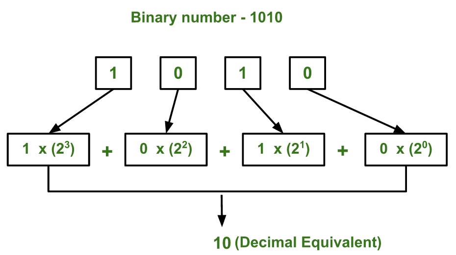
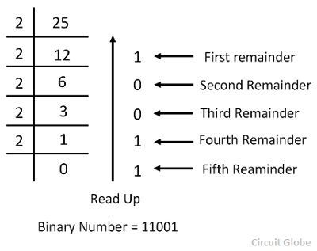

## Bit Manipulation (PART-1)

**Bit Manipulation :** Performing operations directly on binary digits (bits) of a number using programming.

### What is Bit ?
A bit is the smallest unit of data in a computer.
It can store only one value.(**0 or 1**)

- Computers don't understand letters or numbers like humans.
-  They understand only two signals:  
     0 -> False  
     1 -> True  

#### To understand bit Manipulation easily,we first learn the binary number system , decimal number system , and their conversions.

### Binary Number System :  
- The binary number system is generally used in digital computer.
- The binary number system is a positional weighted system.
- The base or radix is '2'.
- The number system has two independent symbols, that are 0 and 1.
- The binary point separates the integer part and fractional part.
- *Example* : 11001.001  
   from above example, here '11001' is a integer part. Here point(.) is called binary point.After binary point '001' is a fractional part.
- Each bit carries a weighted based on its position relative to binary point,
- The positional weight of a binary system as follows :  
  2k, 2k-1, …, 20.2-1, 2-2, …, 2-k

### Decimal number system :  
- The decimal number system the base or radis is '10'
- The decimal number system contains ten unique symbols(0-9).
- Each symbol in decimal number is called a bit.
- The decimal system position weights as follows :  
10k, 10k-1, …, 100. 10-1, 10-2, …, 10-k  

### Decimal vs Binary

## Decimal vs Binary Conversion Table

| Decimal Number | Binary Number (4-bit) |
|---|---|
| 0 | 0000 |
| 1 | 0001 |
| 2 | 0010 |
| 3 | 0011 |
| 4 | 0100 |
| 5 | 0101 |
| 6 | 0110 |
| 7 | 0111 |
| 8 | 1000 |
| 9 | 1001 |
| 10 | 1010 |
| 11 | 1011 |
| 12 | 1100 |
| 13 | 1101 |
| 14 | 1110 |
| 15 | 1111 |

## CONVERSIONS:
### Binary to Decimal :
- Suppose we want to convert the given binary number into equivalent decimal number by using positional weight method.  
- In positional weight method each and every digit of given number is multiplied with its corresponding positional weight.
- All product term such as binary digit and positional weight are added to get a equivalent decimal number.

**Example**:

## Binary to Decimal Conversion

### Question
Convert (1010)₂ to decimal (base 10).

### Solution

Multiply each binary digit by its positional weight (power of 2).

= 1 × 2³ + 0 × 2² + 1 × 2¹ + 0 × 2⁰  
= 1 × 8 + 0 × 4 + 1 × 2 + 0 × 1  
= 8 + 0 + 2 + 0  
= 10

### Final Answer
(1010)₂ = (10)₁₀

## pseudocode(Binary to decimal conversion)
- Start
- Input binary number
- Set decimal = 0
- Set power = 0

- While binary number is not equal to 0:  
    a. Get last digit of binary (lastdigit = binary % 10)  
    b. decimal = decimal + lastdigit × 2^power  
    c. Remove last digit from binary (binary = binary / 10)  
    d. Increase power by 1

- Print decimal
- End

 

## Decimal to Binary Conversion:
- In this method,decimal integer number is converted to binary integer number by successive division-by-2 method,and decimal fraction is converted into binary function by successive multiplication-by-2 method.
- In succcessive division-by-2 method , the given decimal integer number successivey divided-by-2 ,till quotient is zero.The last remaindedr is MSB bit.The remainder read from bottom to top.
- In successive multiplication  by 2 method.The decimal fraction and subsequent decimal fraction are successively multiplied by 2 till the fraction of product is zero.
- Thus, integers are read from top to bottom gives one equivalent binary fraction.

**Example**:

### Question

Convert (25)₁₀ to binary (base 2).

### Solution

Divide the decimal number by 2 repeatedly and write the remainders.

25 ÷ 2 = 12 remainder 1
12 ÷ 2 = 6 remainder 0
6 ÷ 2 = 3 remainder 0
3 ÷ 2 = 1 remainder 1
1 ÷ 2 = 0 remainder 1

Write remainders from bottom to top:

Binary = 11001

### Final Answer

(25)₁₀ = (11001)₂

## Pseudocode(Decimal to Binary Conversion)
1. Start

2. Input decimal number

3. Create empty string binary

4. While decimal > 0:
   a. remainder = decimal % 2
   b. Add remainder at the beginning of binary
   c. decimal = decimal / 2

5. Print binary

6. End

 

