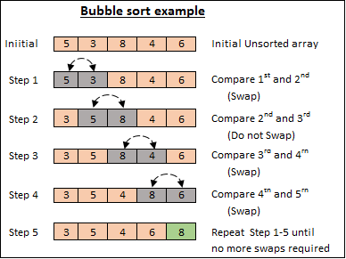

## SORTING

Arrange in order

## Bubble Sort
+ Sorted in Ascending order or Descending Order. 
+ Repeatedly compares and swaps adjacent elements until the list is sorted.

**Example**  

  

From Above Example:

+ The given array is not in ascending or descending order.It is also known as "UNSORTED ARRAY".  
+ Now, we want to arrange in ORDER by using BUBBLESORT.  

### Logic

+ Start from the first element of the array.
+ Compare current number with next number.
+ if the first number is bigger then swap them.
+ Move one step forwad and repeat.
+ After one round the biggest number goes to the end.
+ Do the same rounds again and again
+ Stop when all numbers are in correct order.


## Code
```
for(int turn = 0; turn<arr.length-1; turn++){
    for(int j=0; j<arr.length-1-turn; j++){
        if(arr[j]>arr[j+1]){
            //SWAP
            int temp = arr[j];
            arr[j] = arr[j+1];
            arr[j+1] = temp;
        }
    }
}
```

**Explanation**  
+ OUTER LOOP : Repeat rounds
+ INNERLOOP : Compare numbers
+ if : Swap if number is bigger
+ After ech round biggest numbers goes last

## Conclusion:

**Compare -> Swap -> Repeat until Sorted**
